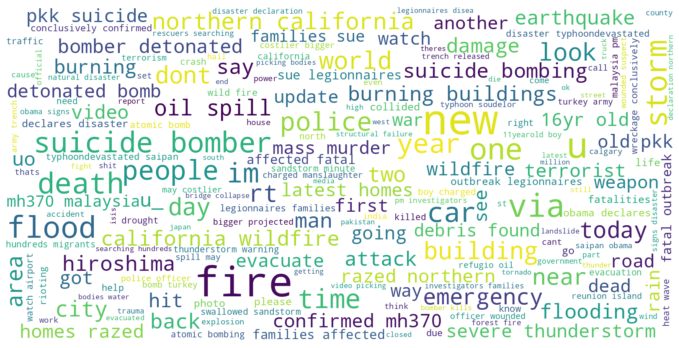

# Description of this portfolio

This portfolio contains my notebooks about machine and deep learning algorithms applied on **text data**. This data was downloaded from different sources and it's freely availble. If you can't see my notebooks here, you can use [nbviewer](https://nbviewer.org/). The notebooks are described below: 

## 1.  [Tweet classification with BERT](notebooks/prediction-of-tweets-using-bert-model.ipynb) 

  

## 2. [BERT visualization with bertviz](notebooks/bert-visualizing-with-bertviz.ipynb)

**Contact**: hiramcoria@gmail.com