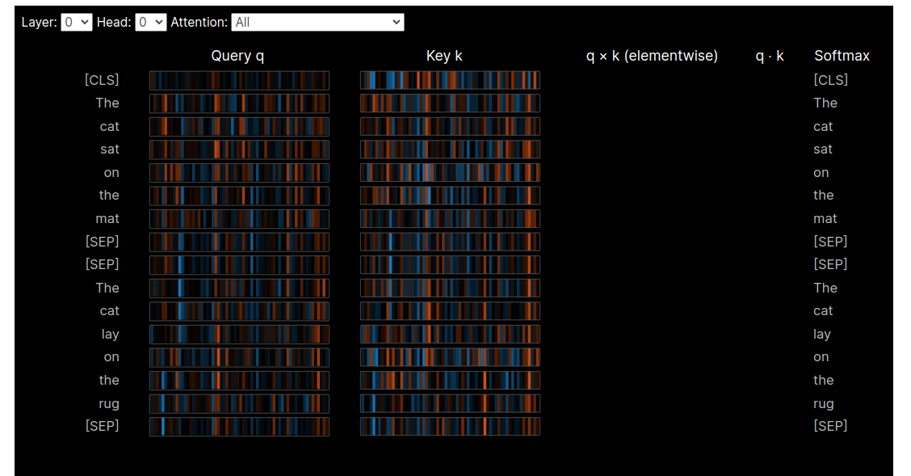

# Description of this portfolio

This portfolio contains my notebooks about machine and deep learning algorithms applied on **text data**. This data was downloaded from different sources and it's freely availble. If you can't see my notebooks here, you can use [nbviewer](https://nbviewer.org/). The notebooks are described below: 

## 1.  [Tweet classification with BERT](notebooks/prediction-of-tweets-using-bert-model.ipynb) 
**Linearly decoded VAE** ([LDVAE](https://docs.scvi-tools.org/en/stable/tutorials/notebooks/linear_decoder.html)) is a generative model similar to PCA which can be used similarly as [scVI](https://docs.scvi-tools.org/en/stable/tutorials/notebooks/api_overview.html), however, due that it has linear functions instead of neural networks it's more easy to interpret its ouput. In this notebook i used this model to get **differential expression analysis**.  
  

## 2. [BERT visualization with bertviz](notebooks/bert-visualizing-with-bertviz.ipynb)

[SCMER](https://scmer.readthedocs.io/en/latest/) (single-cell manifold-preserving feature
selection) was used in notebook to get a compact version of the full dataset. I also do some visualizations and i have to admit that is too easy to use with [Scanpy](https://scanpy.readthedocs.io/en/stable/index.html), once you have your data in form of `adata` object.

**Contact**: hiramcoria@gmail.com